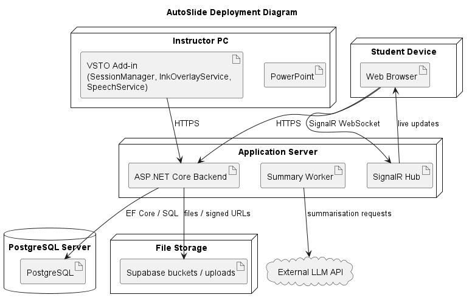

# AutoSlide

AutoSlide is a live presentation platform that connects a PowerPoint VSTO presenter workflow with a browser-based student viewer, live slide navigation, synced ink/transcript, replay/downloadable materials, and optional AI summarization.

## Stack

- `backend/`: ASP.NET Core minimal API (.NET 10) with SignalR, EF Core, Supabase integration, file upload, and session management
- `frontend/`: React 18 + Vite web viewer
- `PowerPointSharing/`: Windows PowerPoint VSTO add-in for presenter session management, ink capture, speech/transcription, and slide control
- Storage: PostgreSQL + Supabase file/storage buckets
- Live sync: SignalR websockets for viewer updates
- AI summarization: optional OpenRouter / Ollama support

## Repo layout

- `backend/` — backend server code, minimal API startup, controllers, services, database, tests
- `frontend/` — student viewer UI, Vite app, React components
- `PowerPointSharing/` — Windows desktop add-in runtime and presentation integration code
- `docs/diagram/` — architecture and sequence diagrams

## Quick start

### Recommended: Docker Compose

From the repo root:

```powershell
docker compose up --build
```

- Backend: http://localhost:5000
- Viewer: http://localhost:3000

This uses the repository `.env` file automatically for container environment variables.

### Manual local startup

#### Backend

```powershell
cd backend
dotnet run
```

#### Frontend

```powershell
cd frontend
npm install
npm run dev
```

The frontend listens on port `3000` by default and expects the backend at `http://localhost:5000`.

## Required configuration

The backend needs these environment variables:

- `SUPABASE_URL`
- `SUPABASE_KEY`
- `SUPABASE_DB_CONNECTION`
- `JWT_KEY`
- `JwtSettings__Issuer`
- `JwtSettings__Audience`
- `JwtSettings__DurationInMinutes`
- `VIEWER_BASE_URL`

Optional AI summarization config:

- `OpenRouter__ApiKey`
- `OpenRouter__Provider`
- `OpenRouter__Model`
- `OpenRouter__OllamaBaseUrl`
- `OpenRouter__OllamaModel`

The backend also has default OpenRouter/Ollama settings in `backend/appsettings.json`.

## Tests and verification

- Backend unit/integration tests:

```powershell
cd backend
dotnet test BackendServer.Tests/BackendServer.Tests.csproj
```

- Frontend build check:

```powershell
cd frontend
npm run build
```

## Architecture visuals



> Render `docs/diagram/deployment_diagram.puml` or `docs/diagram/system_context_diagram.puml` to `docs/diagram/deployment_diagram.png` and update the image path if needed.


> This screenshot shows the student live viewer with a slide and transcript panel. Additional UI captures are available in `docs/UI/`.

## Notes

- The `PowerPointSharing/` project is the Windows presenter add-in; it is only required for instructor-side live session control and ink/transcription capture.
- `docker compose` uses `.env` at the repo root; do not commit secrets to version control.
- If you run locally without Docker, set the same environment variables in your shell or use a local secrets manager.
